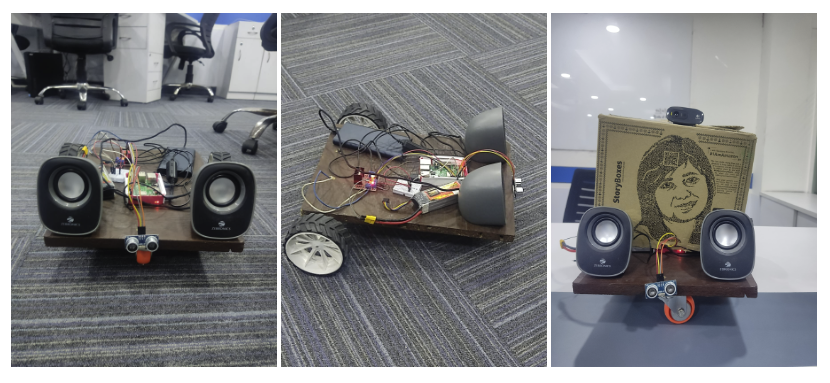

<!-- **Robot Assistant X** is a voice assistant robot developed as a collaborative project. This document provides an overview of the project, including its design, methodology, implementation, and future plans.

## Overview

In today's world, where artificial intelligence and robotics are rapidly advancing, **Robot Assistant X** represents a significant step forward in human-machine interaction. The project combines Natural Language Processing (NLP) with robust hardware to create a user-friendly voice assistant robot. The goal is to provide a tool that is not only efficient but also easy for regular users to interact with.

## Components

### Software Components

* **Server:** Utilizes Raspbian 12 and Python for server operations.
* **Mobile App:** Developed using Flutter for a cross-platform, responsive interface.
* **NLP Model:** Implements an LSTM-based model using TensorFlow and Keras for natural language understanding.
* **Chat Engine:** Uses TensorFlow and Keras for efficient on-device natural language interactions.

### Hardware Components

* **Raspberry Pi:** Serves as the central processing unit for the robot.
* **Chassis:** Constructed from sustainable materials for mounting components.
* **Motors:** Provide locomotion for the robot.
* **Ultrasound Sensor:** Enables distance sensing for obstacle avoidance.
* **Camera:** A Logitech USB camera for video streaming.

## Implementation

### Software Deployment

* Configured the server using Raspbian 12 and developed backend services in Python.
* Created a mobile app using Flutter for user interaction.
* Integrated NLP model with TensorFlow and Keras for natural language understanding.
* Established a Flask web server for video streaming and robot control.

### Hardware Assembly

* Configured GPIO pins on the Raspberry Pi for motor control and distance sensing.
* Utilized an LMD293D dual H-bridge motor driver for precise control of DC motors.
* Integrated ultrasound sensor for obstacle avoidance.
* Connected a Logitech USB camera for video streaming.

## Results

### Machine Learning Model

* Achieved a model accuracy of 96.61% with a well-performing LSTM-based NLP model.
* Demonstrated effective chatting capabilities with users.

### Chatting Output

* Real-time chat interaction showcased successful communication between the user and the robot.

## Future Works

* **Hardware Upgrades:** Consider adding tactile sensors and improved motor controllers for enhanced navigation.
* **Software Advances:** Explore more complex NLP algorithms, possibly incorporating deep learning for nuanced understanding.
* **Extended Functionality:** Develop additional features such as facial recognition and task automation.
* **UI Development:** Refine the mobile app for a better user experience.

## Conclusion

* Successfully delivered **Robot Assistant X**, a user-friendly voice assistant robot.
* Achieved technical milestones in blending NLP with reliable hardware.
* Demonstrated that advanced robotics can be accessible to end-users.
* Overcame challenges, reflecting robust problem-solving and innovation.

## GitHub Repository

For the latest updates and source code, visit our GitHub repository: [Robot Assistant X GitHub Repository](https://github.com/atanuroy911/CS724-RoboX) -->